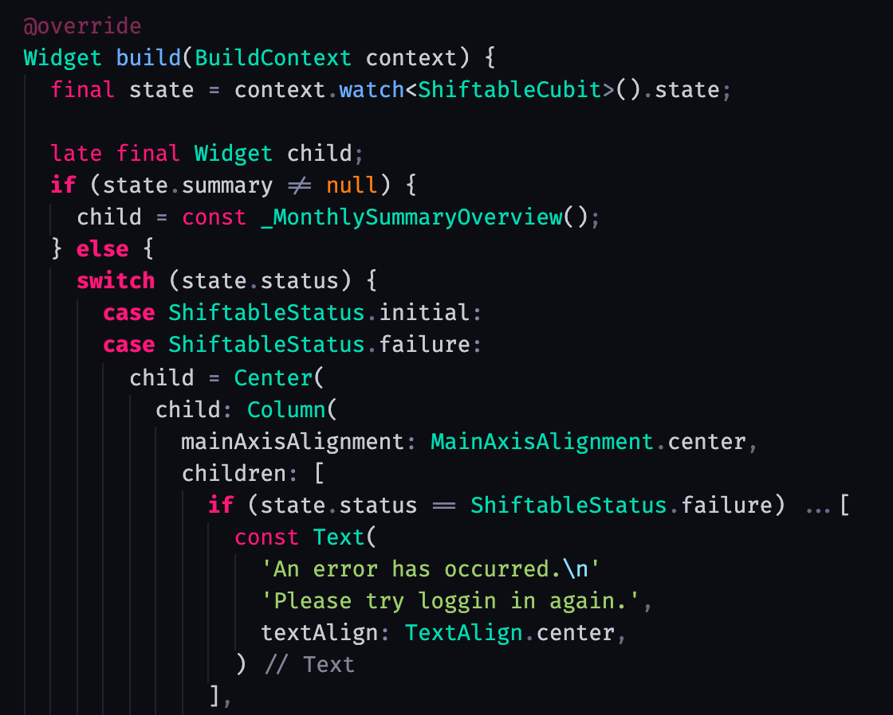

# t0ky0

## A modern, vibrant color theme inspired by Shibuya and Tokyo Night.

t0ky0 is a dark Visual Studio Code color theme featuring bright, vibrant text colors and dark, subtle blue-toned background. With consistent coloring for variables, control flow statements and operators, the goal is to easily draw your attention to the places in your files that matter.  
This project is **based on the excellent [Shibuya][shibuya_jeroen_meijer] color theme by [jeroen-meijer][jeroen_meijer]**.  
The recommended font is [Fira Code][fira_code] with ligatures enabled.

### Color palette

  | `#FF1778` 
  | `#00DBB2` 
  | `#69ADFF` 
  | `#9ECE6A` 
  | `#C7CCD4` 
  | `#666B88` 
  | `#0C0D12` 

### Notes

While this theme has been primarily tested on and optimized for [Dart][dart_lang], [JavaScript][js] and [TypeScript][ts] files, it will work on any language and might receive updates in the future for other languages to be more properly supported.

### See also

- The [Shibuya VS Code color theme][shibuya_jeroen_meijer] by [jeroen-meijer][jeroen_meijer].
- The [Tokyo Night VS Code color theme][tokyo_night] by [enkia][enkia].

**Enjoy!**

[shibuya_jeroen_meijer]: https://github.com/jeroen-meijer/shibuya 'Shibuya by jeroen-meijer on GitHub'
[jeroen_meijer]: https://github.com/jeroen-meijer 'jeroen-meijer GitHub profile'
[fira_code]: https://github.com/tonsky/FiraCode 'Fira Code GitHub repository page'
[dart_lang]: https://dart.dev 'Dart langauge page'
[js]: https://en.wikipedia.org/wiki/JavaScript 'JavaScript Wikipedia page'
[ts]: https://www.typescriptlang.org/ 'TypeScript language page'
[json]: https://www.json.org/json-en.html 'JSON spec page'
[python]: https://www.python.org/ 'Python language page'
